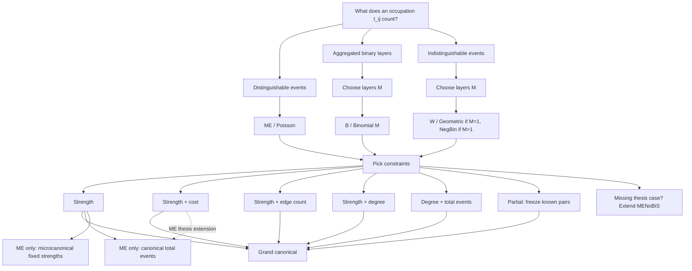

# Choose a null model

## TL;DR

Choose three things: event family, ensemble, and constraints. For most practical
workflows, use the grand-canonical ensemble.

!!! tip "Default recommendation"
    Start with **grand canonical** models. They make node pairs independent,
    which enables streaming, parallel generation/filtering, and lower memory
    pressure than coupled canonical or microcanonical samplers.

## Decision diagram

## Family choice

| Data interpretation | MENoBiS family | Pair law |
|---|---|---|
| Events are distinguishable | `ModelFamily.ME` | Poisson |
| At most `M` events/layers per pair | `ModelFamily.B` | Binomial(M) |
| Events are indistinguishable | `ModelFamily.W` | geometric (`M=1`) or negative-binomial (`M>1`) |

## Constraint choice

| Constraint | Use when |
|---|---|
| strength | origin and destination totals are the structural baseline |
| strength-cost | distance, travel time, or another pair cost is part of the null |
| strength-edges | total binary support size matters |
| strength-degree | each node's binary support matters |
| degree-events | support is primary and total events set positive occupations |
| partial | some pair occupations are known and must be frozen |

## Ensemble choice

| Ensemble | Available cases |
|---|---|
| grand canonical | default for ME, B, W; independent pairs |
| canonical | current public route: ME fixed-strength with fixed total events; strength-cost is a thesis extension path |
| microcanonical | ME fixed strengths via stub matching |

!!! warning "Do not relabel families"
    Same constraints with different event nature lead to different statistics.
    ME, B, and W require different pair equations and solver paths.

## Practical default

Start with ME strength. Add cost or binary constraints only when they are part of
the null hypothesis you want to remove. Use B or W only when the event
interpretation requires those families and check [Solvers and scaling](solvers-and-scaling.md).

## If your case is missing

Do not fake a model by relabeling another family. Add the correct family kernel
and constraint layer; see [Extending thesis cases](../development/extending-thesis-cases.md).
