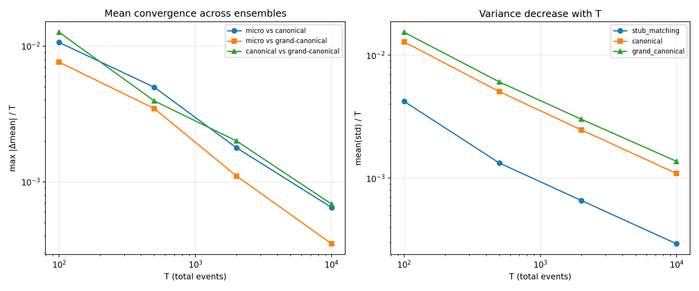
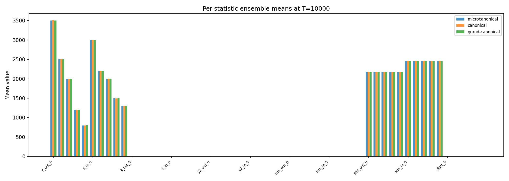
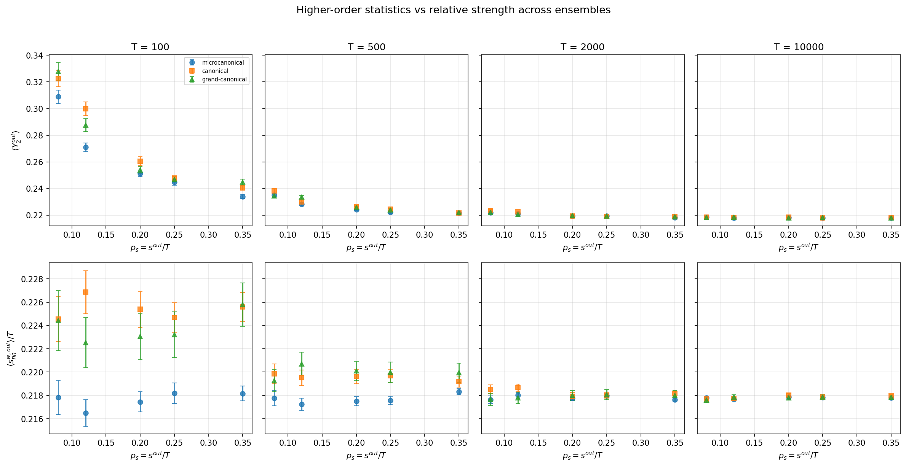

# Ensemble equivalence

## TL;DR

MENoBiS validates three fixed-strength samplers: grand-canonical Poisson,
canonical multinomial, and exact-strength stub matching. Their marginal means
match $\mathbb{E}[t_{ij}] = s_i^{out}s_j^{in}/T$; fluctuations differ and shrink
relative to $T$ as total events grow.

## Three samplers

| Sampler family | Function | Exactly fixed | Fluctuates |
|----------------|----------|---------------|------------|
| Grand-canonical | `sample_strength_poisson` | nothing | $s^{out}$, $s^{in}$, $T$ |
| Canonical | `sample_strength_multinomial` | $T$ | $s^{out}$, $s^{in}$ |
| Stub-matched exact strength | `sample_strength_stub_matching` | $s^{out}$, $s^{in}$, $T$ | edge weights only |

All three have the same target marginal expectation:

$$
\mathbb{E}[t_{ij}] = \frac{s_i^{out} s_j^{in}}{T} = x_i y_j.
$$

## Stub-matched exact-strength sampler

The exact-strength sampler uses directed stubs:

1. Create $s_i^{out}$ outgoing stubs for each node $i$.
2. Create $s_j^{in}$ incoming stubs for each node $j$.
3. Shuffle incoming stubs uniformly.
4. Pair outgoing stub $r$ with shuffled incoming stub $r$.
5. Aggregate repeated pairs into integer edge weights.

This is uniform over matchings of distinguishable event stubs. The induced
distribution over aggregated occupation matrices is not uniform over all
integer matrices with the same strength sequence; matrices with more stub
labelings have larger probability. That is the intended ME event model.

Self-loops are required for unbiased direct stub matching. Sampling exact
strengths while forbidding self-loops needs a different constrained algorithm
such as MCMC.

## Validation protocol

1. Fix heterogeneous relative profiles `p_out` and `p_in`.
2. For `T` values 100, 500, 2000, and 10000:
   - compute balanced integer strengths from `round(T * p)`;
   - generate 200 samples from each sampler;
   - compute strengths, degrees, Y2 disparity, nearest-neighbor statistics,
     and clustering.
3. Assert that sample means converge toward the same analytical marginals and
   relative differences shrink as `T` grows.

## Results

### Mean convergence

At large `T`, normalized differences between ensemble means decrease:



### Per-statistic comparison at T=10000

At `T = 10000`, all sampler families produce close means for computed graph
statistics:



### Per-node higher-order statistics

Y2 disparity and weighted nearest-neighbor strength are plotted against
relative outgoing strength $p_s=s^{out}/T$:



## Running the validation

```bash
uv run pytest tests/test_menobis_ensemble_equivalence.py -q
```

The test updates figures in `docs/figures/`.
