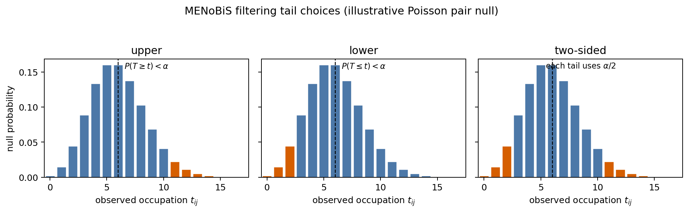

# Filtering statistics

## TL;DR

Filtering asks whether an observed node-pair occupation is surprising under a
fitted independent null model. The output is an edge classification, not a new
network model.



## Tail choices

| Tail | Test |
|---|---|
| `upper` | observed occupation is larger than expected |
| `lower` | positive observed occupation is smaller than expected |
| `two-sided` | split alpha across upper and lower tests |

For observed positive pairs, MENoBiS uses conditional p-values under the
positive support where appropriate. This avoids treating “pair exists” as random
after selecting only existing observed pairs.

!!! note "Two-sided tests"
    A two-sided filter with `alpha=0.05` tests each tail at `0.025`. Report the
    tail and correction whenever you report filtered edges.

## Multiple testing

| Correction | Meaning |
|---|---|
| `none` | compare each p-value directly with alpha |
| `bonferroni` | conservative family-wise correction |
| `fdr` | false-discovery-rate style threshold |

Start with `none` for exploration and report the correction used in scientific
work.

## Absent edges

Absent-edge filtering is optional because it scans candidate pairs with observed
occupation zero. Enable it when missing edges are scientifically meaningful:

```python
result = filter_model(
    edges,
    family=ModelFamily.ME,
    constraint=Constraint.STRENGTH,
    fit=fit,
    detect_absent=True,
    min_occupation=0.5,
    max_absent=1000,
)
```

| Option | Meaning |
|---|---|
| `detect_absent` | scan zero-occupation candidate pairs |
| `min_occupation` | only report pairs likely to be occupied |
| `min_expected` | require a minimum expected occupation |
| `max_absent` | cap output size |

## Interpretation

A significant pair is significant relative to the chosen null constraints. If a
signal disappears after adding cost or degree constraints, it may be explained by
those constraints rather than by higher-order structure.
