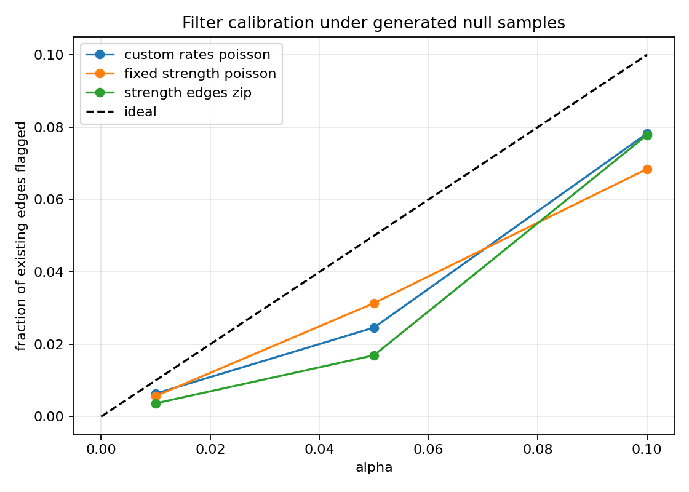

# Statistical filtering

## TL;DR

Filtering compares observed edge weights against an independent MENoBiS null model.
The default test is two-sided with split alpha. Rust streams provider-backed
pair distributions into generic observed and absent filter sinks.

## Tail rules

| Tail | Rule |
|------|------|
| upper | flag if $P(T \ge t) < \alpha$ |
| lower | flag if $P(T \le t) < \alpha$ |
| two-sided | flag upper/lower independently with $\alpha/2$ |

## Implementation pipeline

Filtering shares the same pair-distribution abstraction as generation:

```text
model parameters -> PairDistributionProvider -> PairDistribution -> filter sink
```

`PairDistribution` computes expectations, occupation probabilities, and tail
p-values. Providers expose either all pairs or sparse support, so filtering does
not materialize dense $N^2$ rate matrices.

## Supported nulls

Filtering supports independent grand-canonical distributions through the shared
provider pipeline:

| Constraint | Families |
|-------|--------------|
| strength | ME Poisson, B Binomial(M), W Geometric/Negative-Binomial(M) |
| strength-cost | ME, B, W with cost factor $e^{-\gamma d_{ij}}$ |
| strength-edges | zero-inflated ME, B, W |
| strength-degree | zero-inflated ME, B, W |
| degree-events | Bernoulli occupation plus family-specific positive weights |
| custom / partial | sparse Poisson rates from combined known + free-pair rates |

Partial-constraint filtering uses `filter_custom_poisson` with the combined
rate table from `PartialFitResult.as_probability_table()`.

Canonical multinomial filters are intentionally out of scope because pair tests
are coupled by the fixed total event count. Custom inputs therefore use
independent Poisson rates, not fixed-total multinomial probabilities.

## Absent edges

Absent-edge filtering is opt-in. It streams provider candidate pairs with
observed weight zero and keeps only pairs whose null occupation probability
satisfies:

$$
P(t_{ij}>0) \ge \texttt{min\_occupation}.
$$

For Poisson models, $P(t_{ij}>0)=1-e^{-\lambda_{ij}}$.

## Python API

```python
from menobis.filtering import (
    filter_strength_poisson,
    filter_strength_cost_poisson,
    filter_strength_degree_poisson,
    filter_strength_edges_poisson,
    filter_degree_events_poisson,
    filter_custom_poisson,
)

result = filter_strength_poisson(
    edges,
    alpha=0.05,
    tail="two-sided",
    detect_absent=True,
    min_occupation=0.5,
)
```

`result.upper`, `result.lower`, `result.compatible`, and
`result.absent_lower` contain sparse edge tables plus p-values.

## CLI

```bash
menobis filter strength-poisson edges.csv --output-prefix filtered/
menobis filter strength-edges-poisson edges.csv --target-edges 500 --output-prefix filtered/
menobis filter strength-cost-poisson edges.csv --coordinates xy.csv --target-cost 1.5 --output-prefix filtered/
menobis filter strength-degree-poisson edges.csv --output-prefix filtered/
menobis filter degree-events-poisson edges.csv --output-prefix filtered/
menobis filter custom-poisson edges.csv --rates rates.csv --output-prefix filtered/
```

The custom Poisson file must contain `source,target,rate`, where `rate` is the
occupation number $T p_{ij}$.

## Calibration benchmark



The calibration is conservative because p-values are discrete and the plotted
fraction is measured over existing positive edges. Generate the calibration data
and figure with:

```bash
uv run python benchmarks/bench_filter_calibration.py
uv run python benchmarks/plot_filter_calibration.py
```
