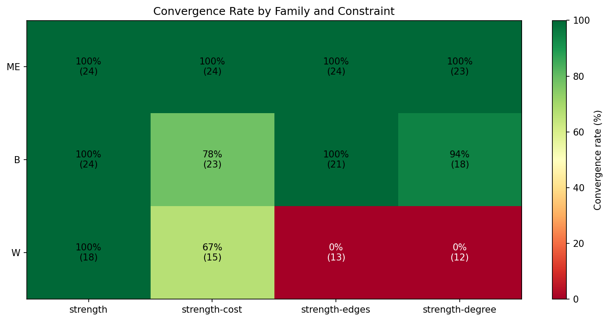
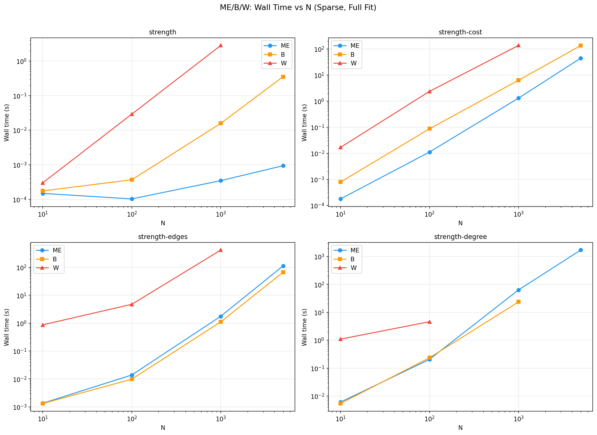
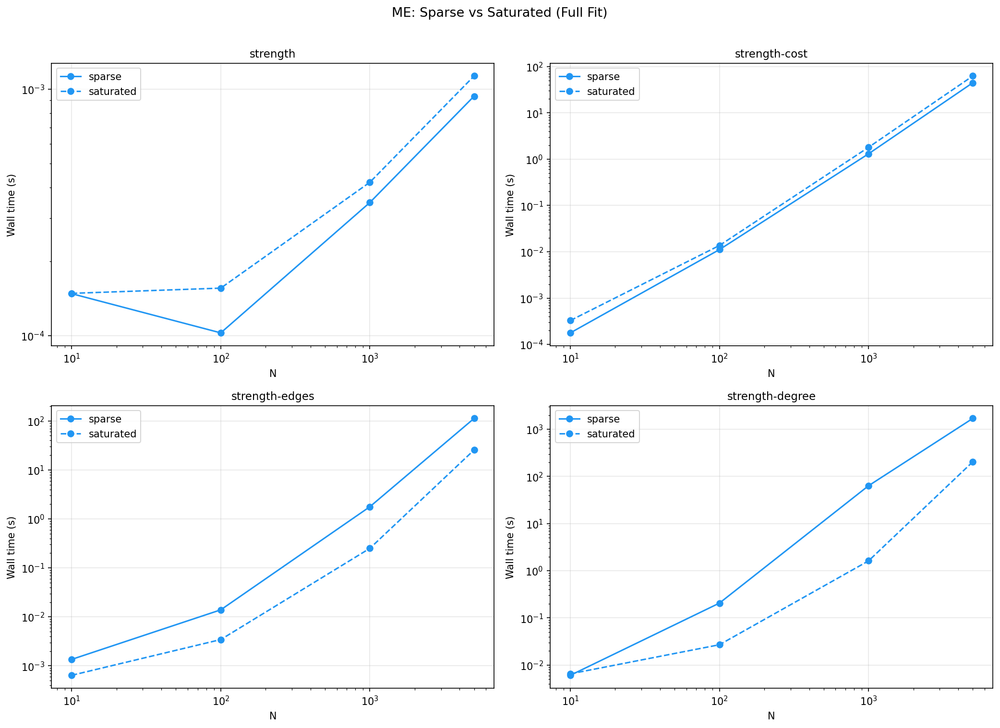
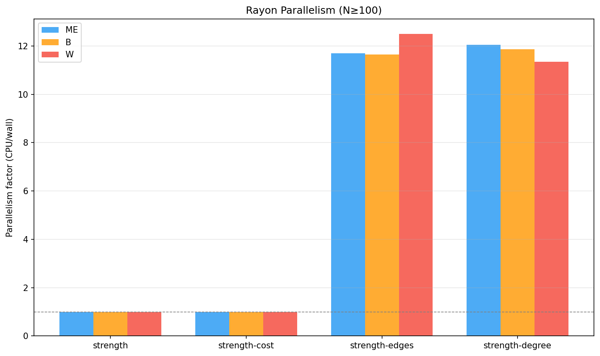

# Benchmark Results: All Families (ME, B, W)

> TL;DR: Comprehensive benchmark across families ME, B, W for N = {10, 100,
> 1000, 5000}, all four constraint types, sparse and saturated regimes, with
> 0%, 5%, and 20% known-pair partial fitting. ME converges at 100% in all
> cases. B converges in 89% of cases. W converges only for strength (100%)
> and some strength-cost cases; strength-edges and strength-degree never
> converge.

## Key findings

### Convergence

| Family | strength | strength-cost | strength-edges | strength-degree |
|--------|----------|---------------|----------------|-----------------|
| **ME** | **100%** | **100%** | **100%** | **100%** |
| **B**  | **100%** | 78% | **100%** | 94% |
| **W**  | **100%** | 67% | **0%** | **0%** |

Details:
- **ME**: All 93 fit cases converged.
- **B**: strength-cost saturated at N=1000+ fails (IPF hits 10k max iterations
  despite tight strength precision ~10⁻¹⁰); strength-degree sparse kp=20% at
  N=1000 fails (overflow in ZI multiplier search).
- **W**: strength-cost diverges for partial fits at all N; strength-edges and
  strength-degree never converge even at N=10. Only W strength is fully
  reliable.

### Wall time

### ME wall time (sparse, full fit)

| Constraint | N=10 | N=100 | N=1000 | N=5000 |
|------------|-----:|------:|-------:|-------:|
| strength | 0.0003 s | 0.0003 s | 0.002 s | 0.001 s |
| strength-cost | 0.0003 s | 0.011 s | 1.23 s | 44.7 s |
| strength-edges | 0.0015 s | 0.013 s | 1.88 s | 112.6 s |
| strength-degree | 0.006 s | 0.21 s | 31.3 s | 1703 s (28 min) |

### B wall time (sparse, full fit)

| Constraint | N=10 | N=100 | N=1000 | N=5000 |
|------------|-----:|------:|-------:|-------:|
| strength | 0.0003 s | 0.0004 s | 0.02 s | 0.35 s |
| strength-cost | 0.0004 s | 0.09 s | 6.34 s | 135.5 s |
| strength-edges | 0.0008 s | 0.01 s | 1.12 s | 66.5 s |
| strength-degree | 0.006 s | 0.24 s | 23.6 s | — (overflow) |

### W wall time (sparse, full fit)

| Constraint | N=10 | N=100 | N=1000 |
|------------|-----:|------:|-------:|
| strength | 0.0003 s | 0.04 s | 2.82 s |
| strength-cost | 0.02 s | 2.37 s | 137.4 s |
| strength-edges | 0.87 s | 4.74 s | 418.0 s (✗) |
| strength-degree | 1.09 s (✗) | 4.60 s (✗) | — |

### Regime comparison (ME)

- **strength**: Sparse and saturated are similar (IPF converges in 2–5 iters).
- **strength-cost**: Saturated is slightly slower (more IPF iterations).
- **strength-edges**: Sparse is **slower** than saturated — ZI Poisson solver
  needs more iterations for sparse binary supports.
- **strength-degree**: Sparse is **much slower** than saturated — degree
  constraints in sparse networks need many more L-BFGS iterations.

### Parallelism

| Solver class | Constraints | Parallelism |
|---|---|---|
| IPF (sequential) | strength, strength-cost | 1.0× |
| L-BFGS (rayon) | strength-edges, strength-degree | 11–13.5× |

IPF solvers are inherently sequential. L-BFGS solvers parallelise the
O(N²) gradient computation across all available cores (14 threads on
Intel Ultra 5 125U). B and W use the same solver architecture and
show similar speedup factors.

### Partial fitting overhead

Partial fitting (5% and 20% known pairs) adds overhead for IPF solvers:

- **strength partial**: ~1.5–3× slower (mask iteration).
- **strength-cost partial**: ~3–9× slower (mask + distance).
- **strength-edges/degree partial**: ~1–2× overhead (L-BFGS handles masks
  efficiently).

### B strength-cost saturation convergence

B strength-cost saturated at N=1000 and N=5000 fails to converge within
10,000 IPF iterations despite achieving excellent precision
(`max_s_err ≈ 10⁻¹⁰`). The solver plateaus with a small residual that never
drops below tolerance. This is a known algorithmic limitation noted in
`docs/decisions/convergence-issues.md`.

### W solver failures

The W (geometric / negative binomial) family has fundamental solver issues
beyond fixed-strength:

| Case | Symptom | Root cause |
|---|---|---|
| W strength-cost partial | max_s_err ~1–500, not converging | Conic solver boundary: q approaches 1.0 for high-strength nodes |
| W strength-edges | max_s_err ~10⁴–10⁶, NaN in gradient | ZI W formula unstable when l_ij * G_W(q_ij) >> 1 |
| W strength-degree | max_s_err ~10⁴–10⁶ | ZI W with per-node multipliers amplifies numerical instability |

These are documented in `docs/decisions/convergence-issues.md` as P1/P2/P3.
The proposed fix is a barrier formulation with adaptive damping, but has not
been implemented.

## N=5000 gap analysis

The following cells at N=5000 could not be run within the timeout or failed:

| Family | Constraint | Regime | kp% | Status |
|--------|------------|--------|-----|--------|
| B | strength-degree | sparse | 0% | Overflow error (z values ~1e+262) |
| B | strength-degree | sparse | 5% | Overflow error |
| B | strength-degree | sparse | 20% | Overflow error |
| B | strength-cost | saturated | 0% | Did not converge (10k iters) |
| B | strength-cost | saturated | 5% | Did not converge (10k iters) |
| B | strength-cost | saturated | 20% | Timed out |
| B | strength-edges | saturated | 0–20% | Timed out |
| B | strength-degree | saturated | 0–20% | Timed out |
| W | (all except strength) | N=1000+ | all | Fail/not run |

## Results file

Full merged JSON: `benchmarks/results/all-benchmark.json` (245 rows across
all families, constraints, regimes, and partial fractions).

Individual per-family files:
- `benchmarks/results/me-benchmark.json` (103 rows)
- `benchmarks/results/bw-benchmark.json` (parsed from logs, 142 rows)
