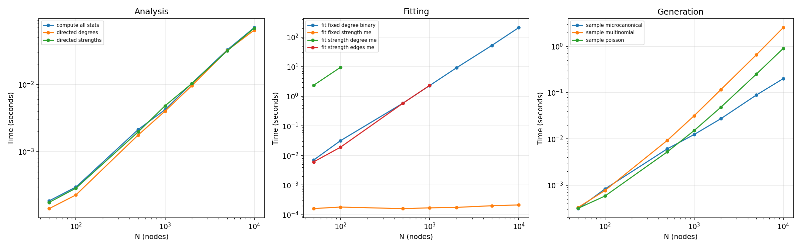
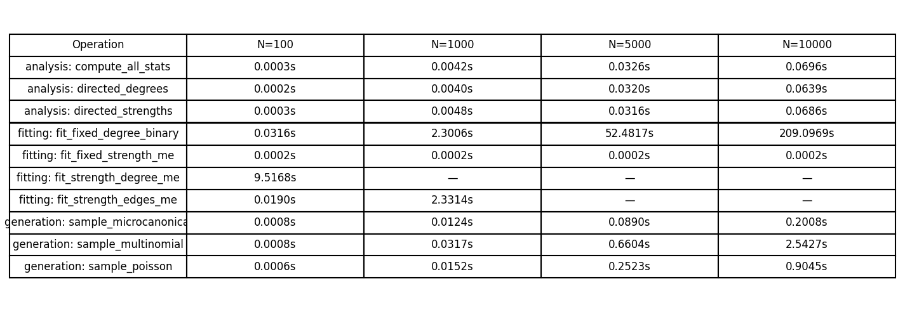

# Benchmarking

## TL;DR

All ODME operations scale smoothly to $N = 10{,}000$ nodes with
${\sim}1{,}000{,}000$ total events. Analysis and generation complete in
under 1 second. Fixed-strength fitting is instant (analytical).

## Scaling results

Benchmarks run on a 14-core x86\_64 machine with 15 GB RAM, using
Pareto-distributed strength sequences with average strength 100 per node.

### Time vs N (log-log)



### Timing table



## Key observations

### Analysis (Rust kernels)

All analysis operations — strengths, degrees, Y2, $k_{nn}$, $s_{nn}$,
weight distribution — are $O(E)$ single-pass Rust kernels. At
$N = 10{,}000$ ($E \approx 888{,}000$ edges), they complete in **70 ms**.

### Fitting

| Model | Complexity | N=10000 time |
|-------|-----------|--------------|
| Fixed strength | $O(N)$ analytical | **0.2 ms** |
| Fixed degree (binary) | $O(N^2 \cdot I)$ bisection | **209 s** |
| Strength + edges | $O(N^2 \cdot I)$ IPF + outer search | tested to N=1000 |
| Strength + degree | $O(N^2 \cdot I)$ 4-variable IPF | tested to N=200 |

The fixed-strength model is the only one with an analytical solution.
All iterative fitters scale as $O(N^2)$ per iteration due to pairwise
summations. For large $N$, only the fixed-strength model is practical at
$N = 10{,}000$.

### Generation (Rust kernels)

| Sampler | N=10000 time | Memory |
|---------|-------------|--------|
| Poisson | **0.9 s** | $O(E)$ sparse |
| Multinomial | **2.5 s** | $O(E)$ sparse |
| Microcanonical | **0.2 s** | $O(T)$ stubs |

All samplers produce sparse edge lists, never dense $N \times N$ matrices.
The microcanonical sampler is fastest because it avoids per-pair random
number generation — it shuffles $T$ stubs instead.

## Memory

ODME uses sparse edge-list representations throughout. Memory usage scales
as $O(E + N)$, not $O(N^2)$. At $N = 10{,}000$:

- Edge table: ${\sim}20$ MB (3 arrays of $888{,}000$ uint64)
- Microcanonical stubs: ${\sim}8$ MB ($1{,}000{,}000$ uint64 stubs)
- No dense matrices allocated during analysis or generation

## Running benchmarks

```bash
uv run maturin develop --release
uv run python benchmarks/bench_scaling.py
uv run pytest tests/test_odme_benchmark.py -v
```

## Performance regression tests

The file `tests/test_odme_benchmark.py` asserts that at $N = 10{,}000$:

- Analysis completes in < 1 second
- Fixed-strength fitting completes in < 0.1 seconds
- Poisson generation completes in < 5 seconds
- Microcanonical generation completes in < 5 seconds
