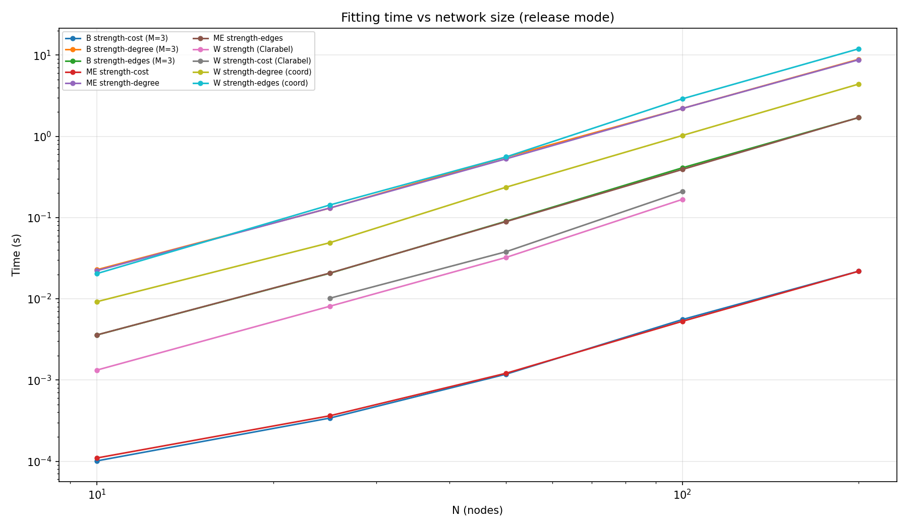
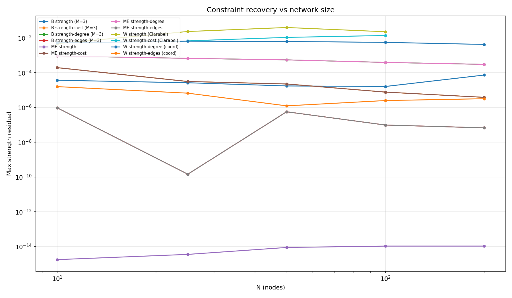

# Benchmarking

## TL;DR

ODME generation streams pair distributions and uses Rayon parallel chunks for
large supports. Use one command to run the benchmark and generate figures.
Strength-degree fitting is the slowest step and runs last.

## Generation cases

| Case | Ensemble | Constraint | Distribution |
|------|----------|-----------|--------------|
| `strength_poisson` | ME | strength | Poisson |
| `strength_multinomial` | ME | strength | Multinomial |
| `strength_poisson_multinomial` | ME | strength | Poisson-multinomial |
| `strength_stub_matching` | ME | strength | Stub matching |
| `strength_binomial` | B | strength | Binomial(M) |
| `custom_poisson_sparse` | ME | custom | Poisson |
| `custom_multinomial_sparse` | ME | custom | Multinomial |
| `degree_events_poisson` | ME | degree-events | zero-inflated Poisson |
| `degree_events_binomial` | B | degree-events | zero-inflated Binomial(M) |
| `strength_cost_poisson` | ME | strength-cost | Poisson |
| `strength_cost_binomial` | B | strength-cost | Binomial(M) |
| `strength_edges_poisson` | ME | strength-edges | zero-inflated Poisson |
| `strength_edges_binomial` | B | strength-edges | zero-inflated Binomial(M) |
| `strength_degree_poisson` | ME | strength-degree | zero-inflated Poisson |
| `strength_degree_binomial` | B | strength-degree | zero-inflated Binomial(M) |

## Scaling characteristics

| Case | N=5000 | N=10000 | N=20000 | Notes |
|------|-------:|--------:|--------:|-------|
| strength Poisson | 0.07 s | 0.22 s | 0.89 s | all-pairs $O(N^2)$ |
| strength binomial (M=10) | 0.21 s | 0.65 s | 2.16 s | denser output |
| strength-edges Poisson | 0.07 s | 0.25 s | 0.98 s | zero-inflated occupation |
| strength-edges binomial (M=10) | 2.2 s | 7.4 s | — | dense B-ensemble |
| strength-cost Poisson | 0.10 s | 0.38 s | 1.65 s | cost-modulated |
| strength-degree Poisson | 0.07 s | 0.25 s | 0.98 s | 4-multiplier zero-inflated |
| degree-events Poisson | 0.07 s | 0.26 s | 0.99 s | Bernoulli + positive Poisson |
| stub_matching | 0.02 s | 0.04 s | 0.08 s | $O(T)$ stubs |
| custom Poisson (sparse) | 0.02 s | 0.03 s | 0.06 s | $O(E_p)$ only |

Binomial cases produce more edges per pair (up to M per pair), leading to
larger output and higher RSS. At N=10000 with M=10, the strength-edges
binomial case generates ~17M edges.

## Memory model

Generation does not materialize dense $N \times N$ probability matrices.
Memory is dominated by:

| Item | Size |
|------|------|
| multipliers | $O(N)$ |
| sparse custom support | $O(E_p)$ |
| sampled output edge list | $O(E_s)$ |
| stub_matching stubs | $O(T)$ |

For binomial cases, $E_s$ can approach $N^2$ when $M$ is large and
multiplier products are high. The total weight is bounded by
$T \le M \times N^2$ (with self-loops).

## Analysis and fitting complexity

| Operation | Method | Complexity |
|-----------|--------|------------|
| directed strengths | single-pass | $O(E)$ |
| all node stats | single-pass | $O(E)$ |
| strength Poisson fit | analytical | $O(N)$ |
| strength binomial fit | IPF with correction | $O(N^2 I)$ |
| degree Bernoulli fit | IPF balancing | $O(N^2 I)$ |
| strength-cost fit | IPF + scalar search | $O(N^2 I K)$ |
| strength-edges fit | IPF + bisection | $O(N^2 I K)$ |
| strength-degree fit | four-variable IPF | $O(N^2 I)$ |

## Running benchmarks

Run the full streaming-generation benchmark and regenerate figures with one
copy-pasteable command:

```bash
uv run maturin develop --release && \
uv run python benchmarks/bench_streaming_generation.py \
  --nodes 10,100,500,1000,5000,10000 --repeats 3 \
  --progress-interval 30 --output-dir benchmarks/results && \
uv run python benchmarks/plot_streaming_generation.py
```

The plot command reads the newest `benchmarks/results/streaming_generation_*.csv`
file and writes:

| Figure | Output |
|--------|--------|
| runtime by case | `docs/figures/streaming_generation_time.png` |
| peak RSS by N | `docs/figures/streaming_generation_rss.png` |

For a quick smoke run plus figures:

```bash
uv run python benchmarks/bench_streaming_generation.py \
  --nodes 100 --repeats 1 --progress-interval 0 && \
uv run python benchmarks/plot_streaming_generation.py
```

For a focused run with specific cases:

```bash
uv run python benchmarks/bench_streaming_generation.py \
  --nodes 100,1000,5000 --repeats 3 \
  --cases strength_poisson,strength_binomial,strength_edges_poisson,strength_edges_binomial
```

`strength_degree_poisson` and `strength_degree_binomial` are always run last.
They require a four-multiplier fit with repeated all-pairs sweeps, so test large
N values separately before adding `N=20000` to a full matrix.

## Fitting benchmarks

The fitting benchmark covers all ME, W, and B families across 5 constraint
types. Run with:

```bash
uv run maturin develop --release -m crates/odme-python/Cargo.toml
uv run python benchmarks/bench_fitting.py --max-n 1000 --tolerance 1e-4 --plot
```

Options: `--max-n N`, `--nodes 50,100`, `--known-fractions 0.05,0.40`,
`--tolerance T`, `--verbose V` (0=quiet, 2=convergence), `--plot`, and
`--output DIR`. Use `--nodes` for exact size-only runs. Partial benchmarks use
known weighted pairs only; occupation contributions are inferred from positive
known weights.

N=100 validation across all full and partial ME/B/W cases:

```bash
uv run python -m benchmarks fit --nodes 100 --max-n 100 \
  --known-fractions 0.05,0.40 --tolerance 1e-4
```

Latest local run: 60 rows, 40 partial rows, 0 failures.

### Scaling (release mode, Pareto strengths)



### Residual accuracy



### Solver limits

| Solver | Constraint | Max N (comfortable) | Bottleneck |
|--------|-----------|---:|---|
| Analytic | ME strength | unlimited | O(N) |
| IPF scalar search | ME cost | 1000+ | O(N² I K) |
| Monotone coordinate | ME/W edges, degree | 200 | O(N² × 60 bisections × iters) |
| Clarabel conic (sparse) | W strength, cost | 150 | O(N² cones) interior-point |
| Scalar root + Bernoulli IPF | degree-events | 1000+ | O(N²) |

## Regression tests

Regression baselines are stored in `benchmarks/regression_baselines.json`.
Tests load thresholds from the JSON file:

```bash
uv run pytest tests/test_odme_benchmark.py -v
```
