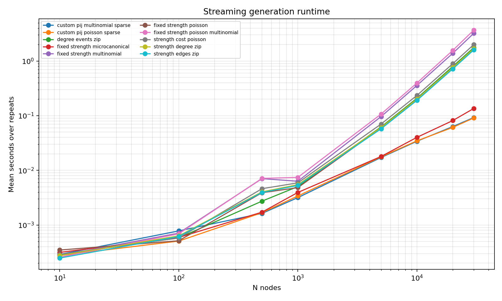
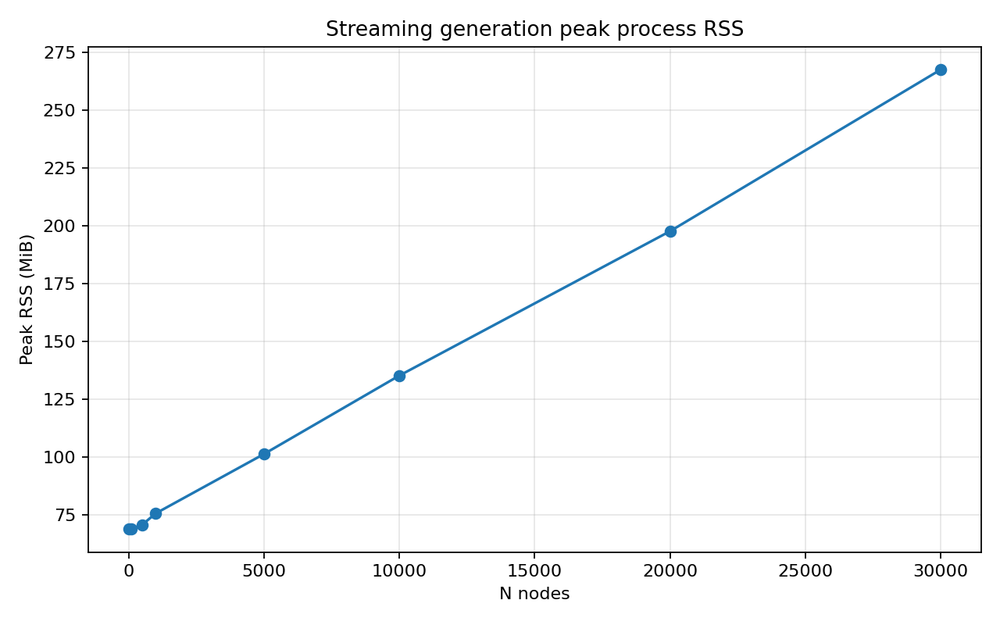

# Benchmarking

## TL;DR

ODME generation streams pair distributions and uses Rayon parallel chunks for
large supports. On a 14-core x86_64 machine, all generation cases in the
streaming benchmark complete through `N = 30000` with peak RSS below 270 MiB.

## Scaling results

Legacy summary figures are generated by `benchmarks/bench_scaling.py`:


## Streaming generation results

Environment: 14-core x86_64, release build, default benchmark parameters
`average_strength=20`, sparse custom support degree `20`, five repeats.

Results are from:

```text
benchmarks/results/streaming_generation_20260517T102410Z.csv
```





| Generation case | N=5000 | N=10000 | N=20000 | N=30000 |
|-----------------|-------:|--------:|--------:|--------:|
| fixed-strength Poisson | 0.060 s | 0.203 s | 0.757 s | 1.659 s |
| fixed-strength multinomial | 0.096 s | 0.357 s | 1.384 s | 3.212 s |
| Poisson-total multinomial | 0.107 s | 0.396 s | 1.564 s | 3.672 s |
| fixed-strength stub matching | 0.018 s | 0.040 s | 0.081 s | 0.135 s |
| sparse custom $p_{ij}$ Poisson | 0.018 s | 0.035 s | 0.061 s | 0.091 s |
| sparse custom $p_{ij}$ multinomial | 0.017 s | 0.034 s | 0.063 s | 0.092 s |
| degree-events ZIP | 0.062 s | 0.208 s | 0.796 s | 1.759 s |
| strength-cost Poisson | 0.070 s | 0.235 s | 0.894 s | 1.996 s |
| strength-edges ZIP | 0.058 s | 0.191 s | 0.718 s | 1.596 s |
| strength-degree ZIP | 0.061 s | 0.201 s | 0.759 s | 1.689 s |

Peak process RSS rose from about 101 MiB at `N=5000` to about 267 MiB at
`N=30000`. The reported RSS is maximum resident set size, not current memory.

## Analysis and fitting

Analysis kernels are single-pass Rust operations over sparse edge lists:

| Operation | Complexity | Memory |
|-----------|------------|--------|
| directed strengths | $O(E)$ | $O(N)$ |
| directed degrees | $O(E)$ | $O(N)$ |
| all node stats | $O(E)$ | $O(N)$ |

Fitting can still require pairwise summations:

| Model | Method | Complexity |
|-------|--------|------------|
| fixed-strength ME | analytical | $O(N)$ |
| fixed-degree binary | IPF balancing | $O(N^2 I)$ |
| strength-cost ME | IPF + scalar search | $O(N^2 I K)$ |
| strength-edges ME | IPF + bisection | $O(N^2 I K)$ |
| strength-degree ME | four-variable IPF | $O(N^2 I)$ |

Streaming generation does not change fitting complexity.

## Memory model

Generation no longer materializes dense $N \times N$ probability matrices.
Memory is dominated by:

| Item | Size |
|------|------|
| multipliers | $O(N)$ |
| sparse custom support | $O(E_p)$ |
| sampled output edge list | $O(E_s)$ |
| microcanonical stubs | $O(T)$ |

All-pairs models still perform $O(N^2)$ random draws, but they stream those
pairs through parallel chunks.

## Running benchmarks

```bash
UV_EXCLUDE_NEWER=2026-05-10 uv run --frozen maturin develop --release
UV_EXCLUDE_NEWER=2026-05-10 uv run --frozen python benchmarks/bench_streaming_generation.py
UV_EXCLUDE_NEWER=2026-05-10 uv run --frozen python benchmarks/plot_streaming_generation.py
```

The default node counts are `10,100,500,1000,5000,10000,20000,30000` with five
repeats. Results are written incrementally to
`benchmarks/results/streaming_generation_*.csv` and `.jsonl`.

For a focused heavy run:

```bash
UV_EXCLUDE_NEWER=2026-05-10 uv run --frozen python benchmarks/bench_streaming_generation.py \
  --nodes 5000,10000,20000,30000 --repeats 5 --progress-interval 10
```

## Regression tests

```bash
uv run pytest tests/test_odme_streaming_generation.py -q
uv run pytest tests/test_odme_benchmark.py -v
```
