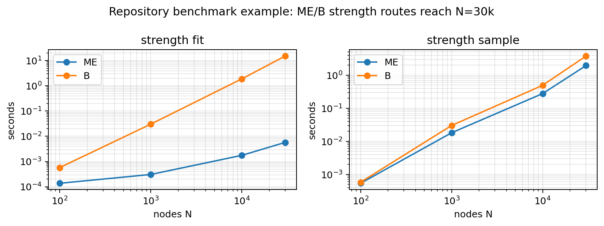

# Scalability

## TL;DR

MENoBiS is designed to keep public workflows sparse or O(N) in memory. Large N is
possible when you can afford the all-pairs time required by some constraints.



!!! note "Benchmark context"
    The plot uses stored repository benchmark results for ME/B strength routes.
    Re-run the benchmark CLI on your machine for local wall-clock numbers.

## Operation costs

| Operation | Typical complexity | Notes |
|---|---:|---|
| edge-list I/O and statistics | O(E) | single pass over observed pairs |
| ME strength fit | O(N) | very large N is practical |
| B/W strength fit | O(N² I) | time grows with all-pairs sweeps |
| degree-events fit | O(N² I) | usually low iteration count |
| strength-edges fit | O(N² I) | zero-inflated; inspect convergence |
| strength-degree fit | O(N² I) | high constant, often slowest |
| strength-cost fit | O(N² I) | costs computed on the fly or bounded caches |
| generation | O(P + E_s) | streams candidate pairs |
| filtering | O(E) or O(P) | absent-edge filtering scans candidates |

## Memory principles

| Data | Preferred representation |
|---|---|
| observed network | sparse `EdgeTable` |
| sampled network | sparse `EdgeTable` |
| custom probabilities | sparse triples |
| multipliers | O(N) arrays |
| costs | on-the-fly provider or sparse state |
| frozen pairs | sparse mask |

!!! tip "Time, not dense storage"
    An O(N²) solver can still have O(N) public state. Expect large runs to be
    CPU-bound rather than blocked by an `N x N` rate matrix.

## Practical guidance

| Goal | Good first choice |
|---|---|
| huge N baseline | ME strength |
| medium N with spatial effect | ME strength-cost |
| support-aware null | ME/B strength-edges before strength-degree |
| W family science | start at small N and inspect diagnostics |
| absent-edge filtering | cap `max_absent` during exploration |

## Regenerate local numbers

```bash
uv run python -m benchmarks all --nodes 100,1000 --families me,b \
  --constraints strength --regime dense --known-pairs 0.0
```

Use larger `--nodes` values once the small run validates your environment.
Long-running benchmark improvements are tracked in [TODOs](todos.md).
