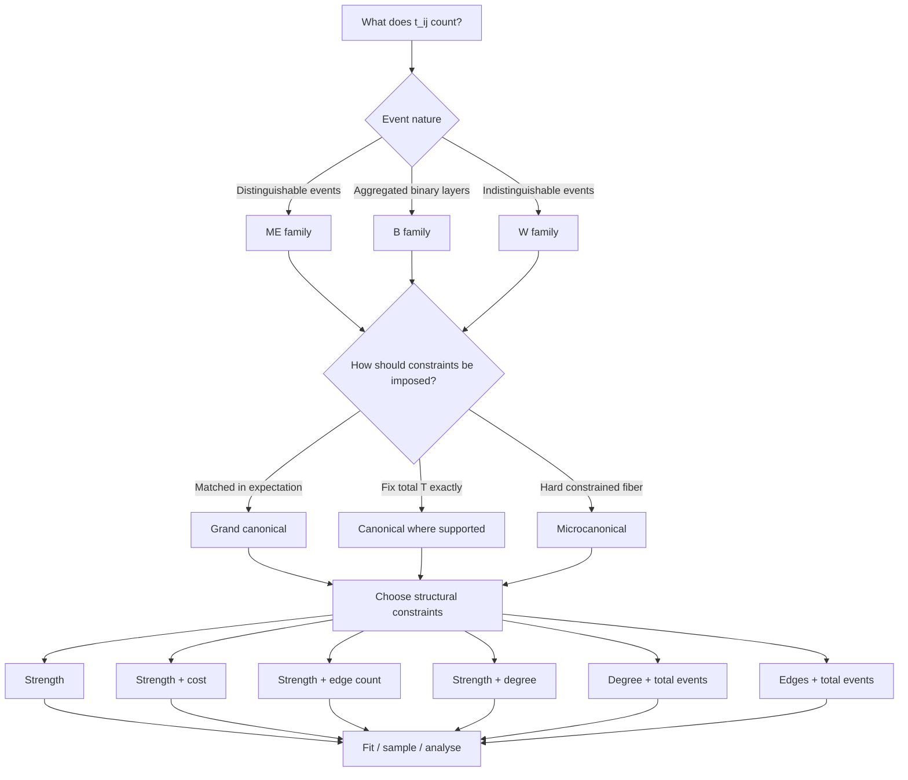

# Choose a model

## TL;DR

Decide, in order:

1. **What does an occupation count?** — this fixes the family ME / B / W.
2. **Which structural effects belong in the null?** — strengths, support,
   degrees, spatial cost, total events.
3. **Exact or expected constraints?** — grand canonical / canonical /
   microcanonical.
4. **What statistic will you interpret?** — constraints interact with the
   statistics you compare.
5. **Is it computationally feasible?** — only after the scientific choice.

> The diagram describes model semantics. Actual supported family × ensemble
> × constraint combinations are listed in the generated capability table on
> [Supported models](supported-models.md). Not every branch of the
> conceptual diagram is implemented for every combination.

## Step 1 — What does an occupation count?

Choose the family by the **nature of the events**, not by speed:

- **ME (multi-edge):** distinguishable events — e.g. individual trips in an
  origin–destination table. Occupations are unbounded integers.
- **B (aggregated binary layers):** occupations are aggregates of \(M\)
  binary layers/trials; each pair occupation is bounded by \(M\).
- **W (weighted):** indistinguishable events sharing a resource; unbounded
  occupations; the fitted pair parameter lives in \((0,1)\).

See [Event families: ME, B, W](../science/event-families.md) for the
probability laws.

## Step 2 — Which structural effects belong in the null?

Possible structural controls:

- node strengths (out/in event sums);
- total occupied support \(E\);
- per-node degrees \(k\) (binary support);
- spatial/pair cost \(C\);
- total occupation \(T\).

Each control removes one class of explanation from the null. Controls that
matter for the phenomenon you study should be in the null; effects you want
to *test* should not.

## Step 3 — Should constraints be exact or expected?

- **Grand canonical:** constraints are matched in expectation; sampled
  networks fluctuate around them. This is the right null when the question
  is *"which structure survives after controlling for the average
  behaviour"*.
- **Canonical:** total occupation \(T\) is fixed exactly; remaining fitted
  structure stays soft. Currently ME strength only.
- **Microcanonical:** the specified hard constraints are identical in every
  sampled network (with the documented hybrid strength+cost exception).

Exact constraints imply a *different null hypothesis*, not a "better" one.
See [Ensembles](../science/ensembles.md).

## Step 4 — What statistic will be interpreted?

Constraints interact with the statistics you compare:

- if you study the degree, a degree constraint makes the degree trivial by
  construction;
- if you study \(Y_2\) (strength concentration), strength constraints do
  not automatically fix it;
- support metrics (\(E\), degree, binary clustering, support motifs) react
  strongly to support constraints — see
  [Ensemble equivalence](../science/ensemble-equivalence.md) and the
  [GC-vs-micro practical comparison](../examples/grand-vs-micro-practical.ipynb).

## Step 5 — Check computational feasibility

Do this **after** the scientific choice:

- all-pairs grand-canonical fitting scales with \(N^2\) per iteration;
- microcanonical sparse states scale with the occupied-pair count;
- the strength+cost microcanonical route includes a fitted gamma search and
  is the slowest MC route.

Never recommend `STRENGTH_EDGES` "instead of" `STRENGTH_DEGREE` as a pure
speed workaround: prefer it only when both null hypotheses are
scientifically acceptable. Quantitative guidance lives in
[Practical scaling](../performance/scaling.md).

## Worked example: concentration of outgoing trips

Observe a directed origin–destination (OD) network, and suppose the analyst
studies the concentration of outgoing trips, e.g. the disparity

\[
Y_{2,i}^{\mathrm{out}}=\sum_j\left(\frac{t_{ij}}{s_i^{\mathrm{out}}}\right)^2.
\]

**Null A — strength only.** Question: *is the observed \(Y_2\) explained by
origin and destination activity marginals?* Fit a strength-only model
(GC or MC).

**Null B — strength + degree.** Question: *is the observed \(Y_2\) still
unusual after also controlling how many destinations each origin reaches?*
Fit a strength + degree model.

- **GC version:** strengths/degrees are matched in expectation and
  fluctuate across sampled networks.
- **MC version:** the chosen hard constraints are identical in every sampled
  network.

Which version you choose changes the scientific question: more constraints
mean a different null hypothesis, not a stricter version of the same one.
There is no speed recommendation attached to this example.

## Next steps

- See what is actually implemented: [Supported models](supported-models.md).
- Run the basic workflow: [Fit and sample](fit-and-sample.md) and
  [Getting started](../getting-started.md).