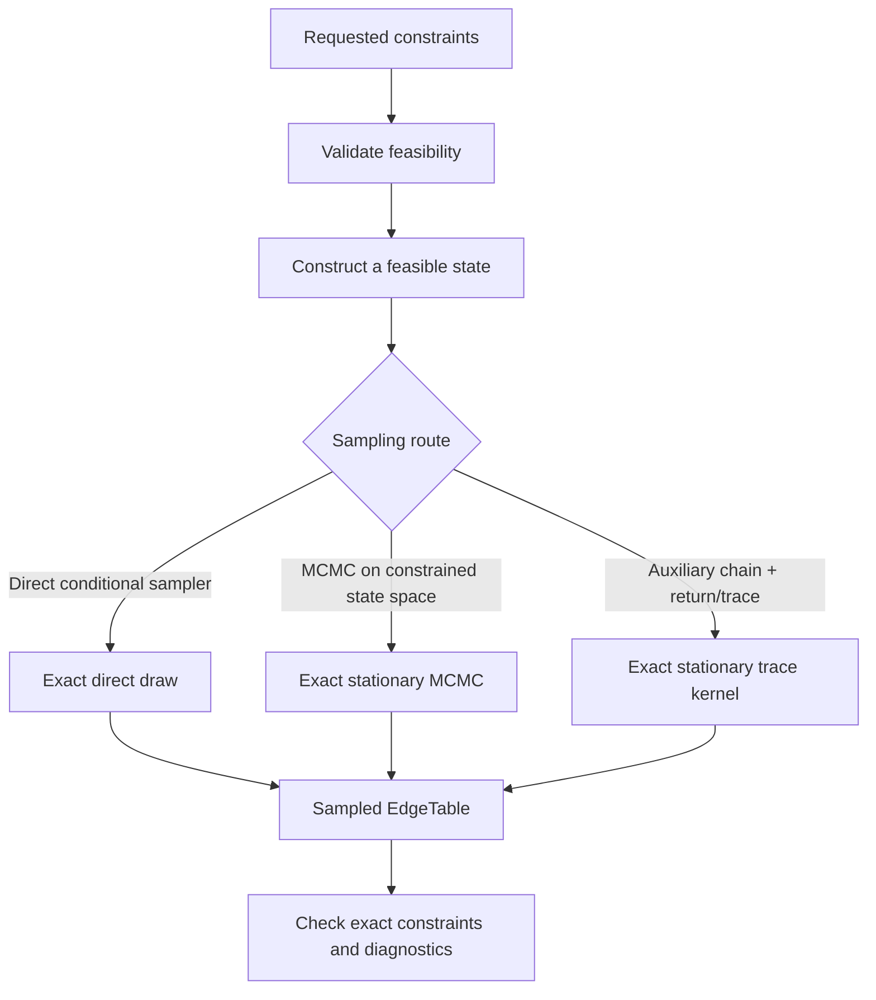

# Microcanonical sampling

## TL;DR

Microcanonical (MC) sampling fixes the requested constraints **exactly** in
every sampled network (with one documented hybrid exception: strength+cost).
You give MENoBiS constraints, it constructs one feasible state, and samples
the target measure on the constraint fiber. No fitting step is required for
MC routes.

## Practical meaning

A grand-canonical null matches constraints in expectation: every sampled
network fluctuates around them. A microcanonical null makes the constrained
quantities **identical in every realization** — a different null
hypothesis, not a "better" one. Choose between them by the scientific
question (see [Choose a model](choose-model.md) and
[Ensembles](../science/ensembles.md)).

## Shared philosophy



- this is the **shared conceptual architecture**;
- concrete constructors and kernels **differ by constraint**;
- construction is not required to be reversible;
- sampling exactness is a property of the **sampling law/kernel**, not of
  how the initial feasible state was found.

## Current routes

The route table below is generated from the capability registry and is
authoritative for backends, required arguments, and exactness:

--8<-- "_generated/microcanonical-routes.md"

Conceptually, the routes are:

| Route | Exact / controlled quantities | Initialization | Sampling | Exactness |
|---|---|---|---|---|
| `(E,T)` | E, T exact | feasible support/occupations | direct conditional sampler | exact direct |
| `(k,T)` | k, T exact | exact-degree support + occupations | MCMC + occupation allocator | exact stationary MCMC |
| `s` | strengths exact | compressed feasible table | occupation MCMC | exact stationary MCMC |
| `(s,E)` | strengths, E exact | exact feasible state | constrained + bridge kernel | exact stationary MCMC |
| `(s,k)` | strengths, k exact | extras-first constructor | degree-fiber trace | exact stationary MCMC |
| `s + cost` | strengths exact, cost expected | feasible strength state | cost-biased route | hybrid |

## One feasible example per constraint

Constraints must be feasible. The robust way to obtain feasible constraints
is to derive them from a valid witness network:

```python
from menobis.models import Constraint, Ensemble, ModelFamily
from menobis.routing import sample_model
from menobis.utilities.synthetic import (
    derive_synthetic_constraints,
    generate_pa_geographic_network,
)

network = generate_pa_geographic_network(30, average_degree=6.0, seed=7)
c = derive_synthetic_constraints(network)

strength_out = c.strength_out.astype("uint64")
strength_in = c.strength_in.astype("uint64")
degree_out = c.degree_out.astype("uint32")
degree_in = c.degree_in.astype("uint32")
```

Then, per constraint:

```python
# (E,T): exact occupied-pair count and total events.
sample = sample_model(
    ensemble=Ensemble.MICROCANONICAL, family=ModelFamily.ME,
    constraint=Constraint.EDGES_EVENTS,
    node_count=len(network.x),
    target_edges=int(network.edges.num_edges),
    total_events=int(network.edges.total_events),
)

# (k,T): exact degree sequences and total events.
sample = sample_model(
    ensemble=Ensemble.MICROCANONICAL, family=ModelFamily.ME,
    constraint=Constraint.DEGREE_EVENTS,
    degree_out=degree_out, degree_in=degree_in,
    total_events=int(network.edges.total_events),
)

# fixed strengths.
sample = sample_model(
    ensemble=Ensemble.MICROCANONICAL, family=ModelFamily.ME,
    constraint=Constraint.STRENGTH,
    strength_out=strength_out, strength_in=strength_in,
)

# (s,E): fixed strengths and exact occupied-pair count.
sample = sample_model(
    ensemble=Ensemble.MICROCANONICAL, family=ModelFamily.ME,
    constraint=Constraint.STRENGTH_EDGES,
    strength_out=strength_out, strength_in=strength_in,
    target_edges=int(network.edges.num_edges),
)

# (s,k): fixed strengths and exact degree sequences.
sample = sample_model(
    ensemble=Ensemble.MICROCANONICAL, family=ModelFamily.ME,
    constraint=Constraint.STRENGTH_DEGREE,
    strength_out=strength_out, strength_in=strength_in,
    degree_out=degree_out, degree_in=degree_in,
)

# s + cost: fixed strengths, cost matched in expectation (hybrid).
sample = sample_model(
    ensemble=Ensemble.MICROCANONICAL, family=ModelFamily.ME,
    constraint=Constraint.STRENGTH_COST,
    strength_out=strength_out, strength_in=strength_in,
    coord_x=network.x, coord_y=network.y,
    target_cost=float(c.total_cost),
)
```

For a hand-written example, explicitly assert basic feasibility: an
occupation cannot be negative, an occupied pair needs at least one event
\(s_i\ge k_i\), and no-self-loop degrees obey \(k_i\le N-1\).

## Exactness

- `(E,T)` routes are **exact direct**: each draw comes from the target
  constrained distribution, up to ordinary pseudorandom sampling error.
- All other routes are **exact stationary MCMC**: the kernel has exactly the
  target distribution as its stationary law, but finite runs need burn-in
  and mixing considerations.
- `s + cost` is **hybrid**: strengths exact, cost expected through
  \(\gamma\). Its `sample_model_detailed` diagnostics report the fitted
  gamma and expected cost (see below).

`sample_model_detailed(..., ensemble=Ensemble.MICROCANONICAL, ...)` is the
entry point returning diagnostics:

```python
from menobis.routing import sample_model_detailed

result = sample_model_detailed(
    ensemble=Ensemble.MICROCANONICAL, family=ModelFamily.ME,
    constraint=Constraint.STRENGTH,
    strength_out=strength_out, strength_in=strength_in,
)
print(result.diagnostics.exactness)  # e.g. exact_stationary_mcmc
```

## Feasibility

See [Constraints: feasibility](../science/constraints.md#feasibility) for
the necessary relations. Recall the B \((s,k)\) capacity bound
\(s_i\le M k_i\), and for \(M=1\) the Bernoulli invariant \(s=k\).

## Diagnostics

For MCMC routes, `sample_model_detailed` reports the generation method and
exactness on `result.diagnostics`, and for the strength+cost route also the
gamma fit (`converged`, `gamma`, `expected_cost`, `observed_cost`,
`cost_residual`). General guidance on burn-in, mixing, autocorrelation and
effective sample size lives in [MCMC diagnostics](../performance/mcmc-diagnostics.md).

## Detailed algorithms

Route-specific kernels and proofs are in the
[Microcanonical algorithms](../development/microcanonical-algorithms.md)
contributor page, with dedicated pages for
[fixed (s,E)](../development/microcanonical-fixed-strength-edges.md) and
[fixed (s,k)](../development/microcanonical-fixed-strength-degree.md).