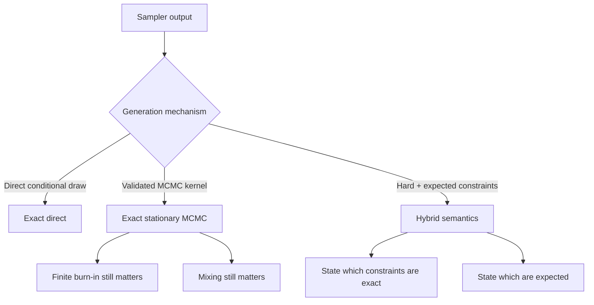

# Validation

## TL;DR

MENoBiS validates exactness mathematically (stationarity/detailed balance),
constraint recovery at the realization level, scalability on the benchmark
matrix, and calibration statistically. Exact stationary laws do **not**
imply rapid mixing; validation evidence is per-route and per-instance.

## Mathematical validation

- **Exact enumeration** on tiny instances where the full target distribution
  can be enumerated, comparing implemented kernels against the closed form;
- **Detailed balance** for Metropolis kernels;
- **Stationarity** — the target measure is invariant for the kernel;
- **Exact conditioning identities** — GC conditioned on hard constraints
  yields the MC target where the identity holds (see
  [Ensemble equivalence](../science/ensemble-equivalence.md)).

## Constraint validation

- realization-level recovery: sampled networks reproduce the constrained
  quantities exactly (microcanonical) or in expectation within tolerance
  (grand-canonical);
- fitted expectation recovery: strengths/degrees/cost/E/T reproduce their
  input sequences within documented relative tolerance.

## Scalability validation

- benchmark sizes and regimes from the
  [benchmark matrix](benchmarks.md) (N=100/500/1000, sparse/dense,
  with and without self loops);
- memory and wall-time provenance per [Practical scaling](scaling.md).

## Statistical validation

- null calibration: p-values of null samples are uniform in the
  compatible region;
- filter false-positive rate control;
- sampled observable comparison: ensemble statistics behave like the
  observed ones when both come from the same null.

## What validation does not prove

Explicitly:

- an **exact stationary law does not imply rapid mixing** — finite-run
  autocorrelation must still be assessed
  ([MCMC diagnostics](mcmc-diagnostics.md));
- one N=1000 benchmark does not prove every heterogeneous instance is easy;
- necessary feasibility tests are not always sufficient for sparse-domain
  feasibility;
- empirical ensemble similarity is not a theorem
  ([Ensemble equivalence](../science/ensemble-equivalence.md)).

## Exactness taxonomy

The supported-model matrix
([Supported models](../guide/supported-models.md)) states the exactness
category per route; the smoke-test suite runs a deterministic end-to-end
workflow per critical route.