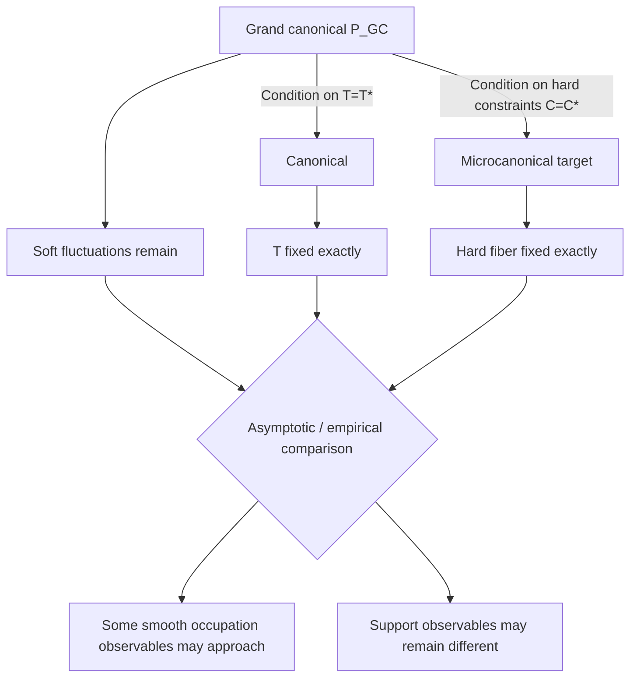

# Ensemble equivalence

## TL;DR

The grand-canonical (GC), canonical, and microcanonical (MC) ensembles are
**different probability laws**. They are connected by exact **conditioning
identities**, and their differences may become negligible for some
observables in some asymptotic regimes — but that is an empirical and
asymptotic question, not an exact equality. Support observables (binary
ones) tend to remain sensitive to the ensemble choice.

## Exact conditioning identity

Let the grand-canonical law be

\[
P_{\mathrm{GC}}(t)\propto d_F(t)e^{-\theta\cdot C(t)}.
\]

On the fiber \(C(t)=C^\star\), the Boltzmann factor

\[
e^{-\theta\cdot C(t)}=e^{-\theta\cdot C^\star}
\]

is constant, so the conditional law is

\[
P_{\mathrm{GC}}(t\mid C(t)=C^\star)
\propto
d_F(t)\mathbf 1[C(t)=C^\star].
\]

This is **exact**: conditioning the GC law on the hard constraints yields
the microcanonical target. It is a conditional identity; it does **not**
imply that unconditional GC and MC are equal.

## Canonical conditioning

Where the canonical ensemble exists (ME + STRENGTH),

\[
P_{\mathrm{CAN}}(t)=P_{\mathrm{GC}}(t\mid T=T^\star).
\]

Again, this is an exact conditioning identity; the practical differences
between conditional and unconditional ensembles are a separate question.

## Asymptotic / large-occupation discussion

Differences between conditional and unconditioned ensembles can become
**negligible for observables insensitive to residual fluctuations of the
conditioned statistics**, in an appropriate asymptotic regime. They do not
"vanish" in any unconditional sense.

The right way to study the question is empirical, at finite \(N\), with the
GC-vs-micro practical comparison notebook
([Practical microcanonical vs grand-canonical comparison](../examples/grand-vs-micro-practical.ipynb))
as the evidence source (see also [Benchmarks](../performance/benchmarks.md)).

## Finite-size hard-vs-soft comparison in practice

The theoretical discussion above studies

\[
N \text{ fixed},\qquad T\to\infty.
\]

The practical comparison notebook
([Practical microcanonical vs grand-canonical comparison](../examples/grand-vs-micro-practical.ipynb))
studies instead

\[
N\in\{100,500,2000\},\qquad
\langle k\rangle\approx 8,\qquad
T/E\approx 8.
\]

> The notebook is not a numerical test of the fixed-\\(N\\), large-\\(T\\)
theorem. It is a finite-size comparison of the current hard and soft MENoBiS
models under a sparse scaling regime.

In that setting:

\[
\text{same target constraints}
\not\Rightarrow
\text{same finite-size probability measure}
\not\Rightarrow
\text{same higher-order observables}.
\]

Micro constraints are exact where documented; GC constraints are matched in
expectation; nonlinear observables (degree when not fixed, \\(Y_2\\),
\\(k_{NN}\\), \\(s_{NN}\\), realized cost) need not agree.

Abbreviated per-constraint semantics, per ensemble:

| Constraint | Grand-canonical | Microcanonical |
|---|---|---|
| `STRENGTH` | strengths in expectation | strengths exact |
| `STRENGTH_COST` | strengths, cost in expectation | strengths exact; cost in expectation (gamma fit) |
| `STRENGTH_EDGES` | strengths, E in expectation | strengths, E exact |
| `STRENGTH_DEGREE` | strengths, degree in expectation | strengths, degree exact |
| `DEGREE_EVENTS` | degrees, T in expectation | degrees, T exact |
| `EDGES_EVENTS` | E, T in expectation | E, T exact |

See the notebook for the finite-size empirical comparison, timing, and the
MCMC budget caveats.

## Support observables

Support uses the discontinuous-at-zero transformation

\[
a_{ij}=\mathbf 1[t_{ij}>0].
\]

Quantities built from it — \(E\), degree sequences \(k\), binary
clustering, support motifs — can remain sensitive to the ensemble choice
even where smooth occupation observables converge. Support observables
cannot therefore be broadly classified as convergent.

## Event-family dependence

ME asymptotics do not generalize to B or W without proof. The three
families have different pair laws and domains (in particular W has
\(q_{ij}\in(0,1)\)), so asymptotic statements must be family-specific.
Three kinds of statements need to be told apart in the discussion:

- exact conditional identities;
- theoretical asymptotic statements;
- empirical observations.

> Conditioning arrows are exact probability identities where the
> corresponding model exists. The bottom comparison is an
> asymptotic/empirical question, not an exact equality.

## Practical notes

- A single benchmark or notebook run is evidence, not a theorem.
- Report conclusions with at least: family, constraint, \(N\), sparsity
  regime, and observable (see
  [Benchmarks](../performance/benchmarks.md) conventions).
- For the scientific choice between GC and MC, see
  [Choose a model](../guide/choose-model.md).