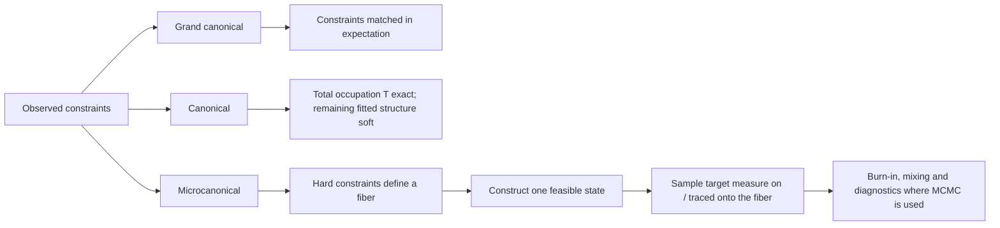

# Ensembles

## TL;DR

An **ensemble** is how the constraints enter the probability law.

- **Grand canonical (GC):** constraints are matched **in expectation**.
- **Canonical:** total occupation \(T\) is fixed **exactly**; the remaining
  fitted structure stays probabilistic.
- **Microcanonical (MC):** the specified hard constraints are fixed
  **exactly**, realization by realization.

For the strength+cost microcanonical route, add explicitly: the route is
**hybrid** — strengths are exact while cost is controlled in expectation
through the cost multiplier.

## Grand canonical

Use the generic sufficient-statistics form

\[
P_{\mathrm{GC}}(t)=\frac{1}{Z(\theta)}
\left[\prod_{ij}d_F(t_{ij})\right]
e^{-\theta\cdot C(t)},
\]

where \(d_F\) is the pair degeneracy of the chosen family and
\(C(t)\) collects the constrained statistics. Implemented GC routes have
independent pair statistics, so sampling factorizes over admissible pairs.

GC constraints fluctuate around their fitted expectations across sampled
networks. That fluctuation is part of the null hypothesis: a GC null asks
whether the observed network is unusual *given that the constrained
quantities average to the observed values*.

## Canonical

MENoBiS canonical sampling **fixes total occupation \(T\) exactly**. The
remaining fitted structure is encoded probabilistically rather than fixed
realization by realization:

\[
P_{\mathrm{CAN}}(t)=P_{\mathrm{GC}}(t\mid T(t)=T^\star).
\]

Canonical is **not** exact-strength sampling. Strengths remain soft,
fitted quantities; only \(T\) is exact. Canonical is currently implemented
for family ME with the STRENGTH constraint (the fitted strengths supply the
multinomial weights and \(T^\star\) supplies the fixed total).

## Microcanonical

For hard constraints \(C(t)=C^\star\),

\[
P_{\mathrm{MC}}(t\mid C^\star)
=
\frac{
\left[\prod_{ij}d_F(t_{ij})\right]
\mathbf 1[C(t)=C^\star]
}{
\Omega_F(C^\star)
},
\]

with

\[
\Omega_F(C^\star)
=
\sum_t
\left[\prod_{ij}d_F(t_{ij})\right]
\mathbf 1[C(t)=C^\star].
\]

The implemented microcanonical routes share a two-stage philosophy:

1. **construct** one feasible state on the constraint fiber;
2. **sample** the target measure on (or traced onto) that fiber.

Different constraints use different constructors and different exact
sampling kernels. The high-level philosophy is shared; the concrete
algorithms are route-specific and are documented in the
[contributor algorithm index](../development/microcanonical-algorithms.md).

## Hybrid cost route

The microcanonical `STRENGTH_COST` route is hybrid:

- strengths are exact;
- cost is controlled **in expectation** through the cost multiplier
  \(\gamma\) (`f_{ij}=e^{-\gamma d_{ij}}`).

Its exactness label is accordingly "exact stationary MCMC with cost matched
in expectation", never "all constraints exact".

## Which combinations exist?

Only a subset of family × ensemble × constraint combinations is
implemented. The authoritative list is the
[generated capability matrix](../guide/supported-models.md), including its
per-route exactness semantics.